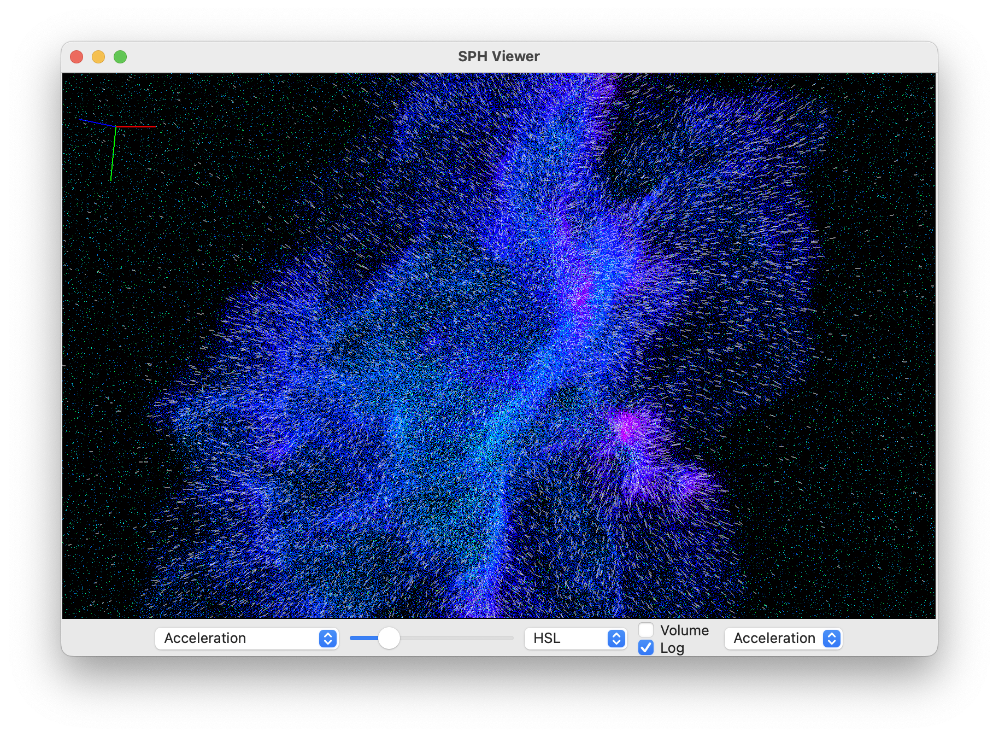

# SPHerture
 GUI Gadget3 HDF5 snapshot viewer.

<p align="center" float="left">
  
</p>

## Version

The module is in pre-alpha stage.

## Quick setup guide

Probably the easiest way to run the program is to use [pyenv](https://github.com/pyenv/pyenv) to set the local Python version and [Poetry](https://python-poetry.org/) manages dependencies. Alternatively, install wxPyhton, vispy, matplotlib, numpy, numba etc. Developed on macOS Sonoma 14.4, can be made to work on WSL Ubuntu-22.04, Windows 11.

1. Install [Poetry](https://python-poetry.org/) and [pyenv](https://github.com/pyenv/pyenv).

2. Clone the repository and enter it's directory.

3. Install and activate Python 3.10.13 for the project:

```bash
pyenv install 3.10.13
pyenv local 3.10.13
```

4. Create virtual environment and install dependencies:

```bash
poetry install
poetry env use 3.10.13
```

5. Run:

```bash
poetry run python3 SPH_viewer.py
```
